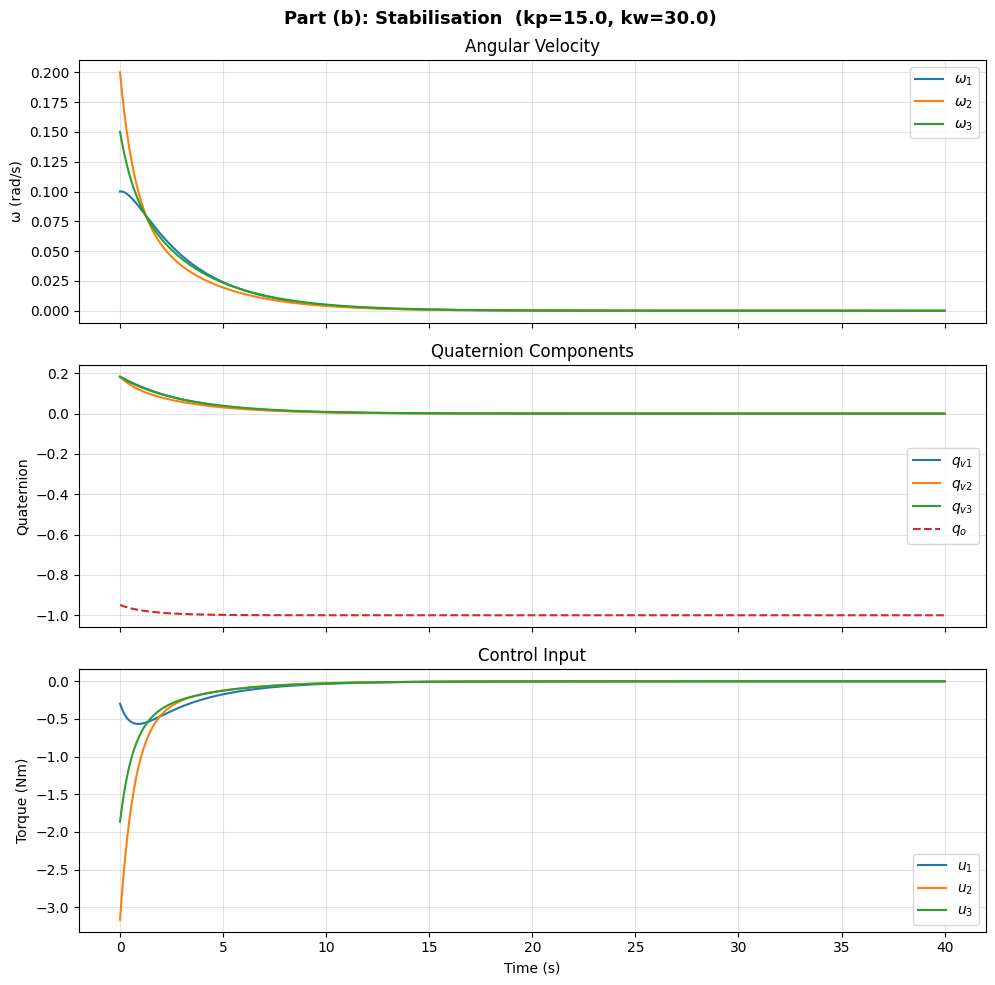
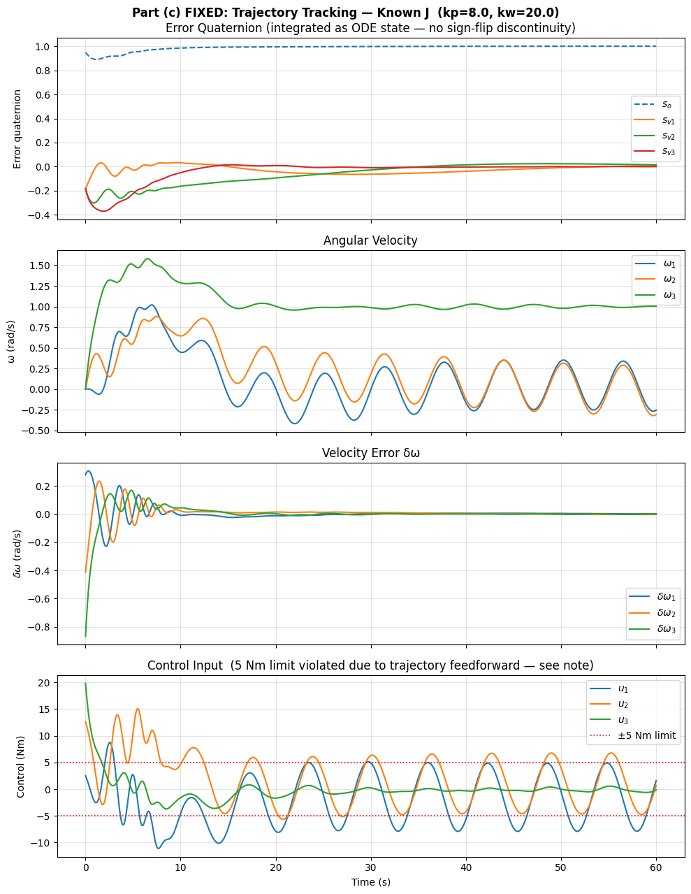
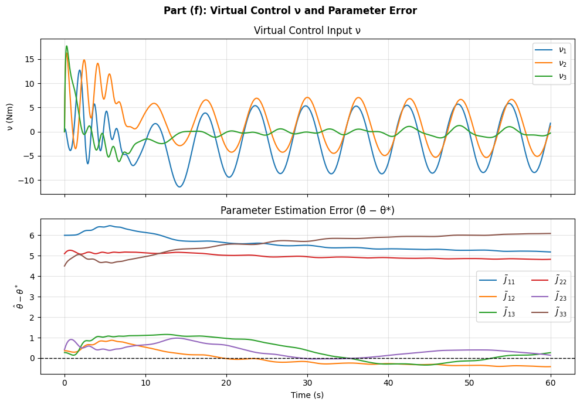

# Spacecraft Attitude Control: From PD Stabilization to Adaptive Backstepping

Simulation and controller design for rigid-body spacecraft attitude tracking, progressing
from open-loop dynamics through PD stabilization, full-state feedback tracking,
integrator backstepping, and adaptive backstepping with an unknown inertia matrix.

Quaternions are used throughout to avoid singularities, with rotation dynamics, error
kinematics, and Lyapunov-based control laws derived from first principles and verified
numerically via simulation.

## Problem Setup

Rigid body attitude dynamics:

```
J ω̇ = -ω × Jω + u          (angular velocity dynamics)
q̇ = 1/2 E(q) ω              (quaternion kinematics)
```

where `J` is the (possibly unknown) inertia matrix and `u` is the control torque.
Tracking error is defined via the error quaternion `s = q ⊗ q_d*`, with error dynamics

```
ṡ = 1/2 E(s) δω
J δω̇ = -ω × Jω + u - Jφ
```

for `δω = ω - R_s ω_d`.

## What's Implemented

| Part | Problem | Approach |
|------|---------|----------|
| (a) | Uncontrolled free rotation | Torque-free Euler dynamics; verifies quaternion unit-norm invariant and bounded energy-conserving motion |
| (b) | Attitude stabilization | PD control with nonlinear cancellation of gyroscopic term; Lyapunov proof via Barbalat's Lemma |
| (c) | Trajectory tracking, known inertia | Full-state feedback with feedforward; error quaternion propagated as an ODE state to avoid a sign-flip discontinuity (see Notes below) |
| (d) | Integrator backstepping | Two-step Lyapunov backstepping construction (kinematic → dynamic level), analogous to linear double-integrator backstepping |
| (e) | Adaptive tracking, unknown inertia | Certainty-equivalence adaptive control with gradient parameter update law; linear-in-parameters regressor over the 6 independent entries of `J` |
| (f) | Adaptive backstepping, torque-rate control | Three-step adaptive backstepping with a Dynamic Surface Control (DSC) filter to avoid analytically differentiating the second virtual control law |

Each part includes the full Lyapunov stability derivation (in the notebook, as markdown/LaTeX)
followed by a numerical simulation and diagnostic plots.

## Results

**Stabilization (Part b)** — driving the spacecraft to rest from a non-zero initial
attitude and angular velocity, with the required state norm `< 1e-3` maintained for `t ≥ 20 s`:



**Trajectory tracking with known inertia (Part c)** — the error quaternion and angular
velocity error both converge to zero under full-state feedback with feedforward
cancellation:



**Adaptive backstepping parameter error (Part f)** — with the inertia matrix unknown
(30% initial offset) and only torque-rate available as control input, tracking error still
converges to zero, but the inertia parameter estimates do not converge to their true
values, since the reference trajectory does not satisfy the persistence-of-excitation
condition:



## Notable Implementation Details

- **Quaternion sign-flip bug and fix (Part c):** Since `R(s) = R(-s)`, naively recomputing
  the error quaternion at each timestep can cause a discontinuous sign flip that reverses
  the sign of the proportional feedback term mid-simulation and destabilizes the closed loop.
  This is fixed by integrating `s` directly as an ODE state (via `ṡ = 1/2 E(s) δω`) with the
  sign fixed once at `t = 0`, rather than recomputing `s` from `q` and `q_d` at every step.
- **Infeasibility check (Part c):** The assigned 5 Nm per-axis torque limit is shown to be
  physically infeasible for the given desired trajectory — the feedforward term alone
  requires ~10 Nm — and this is verified analytically rather than papered over with gain tuning.
- **Persistence of excitation (Parts e, f):** The adaptive laws are shown to guarantee
  tracking convergence (via Barbalat's Lemma) but *not* parameter convergence, since the
  assigned reference trajectory does not satisfy the Persistence of Excitation condition
  (axes 1 and 2 share identical signal content). This is verified numerically: the tracking
  error goes to zero while the inertia parameter estimates settle away from their true values.
- **Dynamic Surface Control (Part f):** Backstepping through a second integrator would
  normally require differentiating the first virtual control law analytically, which produces
  an unwieldy expression. A first-order low-pass filter on the virtual control avoids this
  while preserving closed-loop stability (up to a bounded filtering error).

## Repository Structure

```
├── attitude_control.ipynb    # Full derivations + simulations for parts (a)-(f)
├── problem_statement.pdf     # Original assignment specification
├── figures/                  # Key result plots (embedded above)
└── README.md
```

## Background

This work was completed as part of a graduate course in adaptive control, extended with
additional analysis (bug diagnosis, infeasibility checks, PE discussion) beyond the base
requirements.

Core theoretical reference:
M. Krstic, I. Kanellakopoulos, P. V. Kokotovic, *Nonlinear and Adaptive Control Design*,
Wiley-Interscience, 1995.

## Requirements

```
numpy
scipy
matplotlib
```
